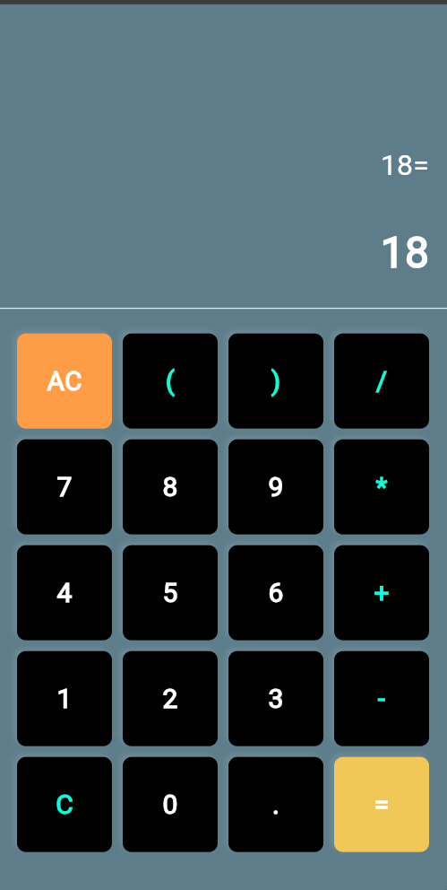

# 🔢 Basic Calculator (Flutter)

A simple calculator app built using **Flutter**. This app performs basic arithmetic operations such as addition, subtraction, multiplication, and division with a clean, mobile-friendly UI.

---

## 📱 Screenshot



> Make sure to save your screenshot as `assets/calculator_screenshot.png` in your project and commit it.

---

## ✨ Features

- Clean and responsive user interface
- Basic math operations: `+`, `-`, `*`, `/`, brackets, decimals
- **AC** (All Clear) and **C** (Backspace) buttons
- Live expression display and result output
- Error handling with a custom message

---

## 🚀 Getting Started

To run this app on your local machine:

### Prerequisites

- Flutter SDK installed
- Emulator or physical device set up

### Steps

```bash
git clone https://github.com/Ra-Ha-Til/basic_calculator.git
cd basic_calculator
flutter pub get
flutter run
